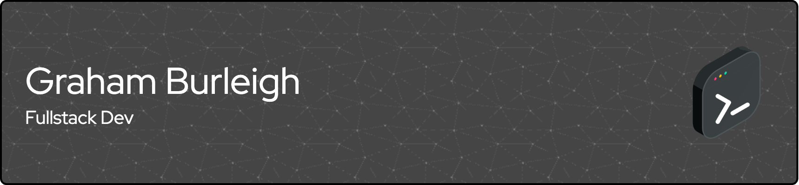

  

Fullstack Developer with a focus on payments, cybersecurity, web development, and architecture design. Passionate about improving UX, optimizing complex systems, fortifying security, and creating cutting-edge products. Reach out to discuss anything fintech, webdev, and security!

  
  

  

<h2>Get in Touch</h2>

  
  
  

<h2>Technologies</h1>

  <table style="border:none">
    <tr>
      <td></td>
      <td></td>
      <td></td>
      <td></td>
      <td></td>
      <td></td>
    </tr>
    <tr>
      <td></td>
      <td></td>
      <td></td>
      <td></td>
      <td></td>
      <td></td>
    </tr>
    <tr>
      <td></td>
      <td></td>
      <td></td>
      <td></td>
      <td></td>
      <td></td>
    </tr>
    <tr>
      <td></td>
      <td></td>
      <td></td>
      <td></td>
      <td></td>
      <td></td>
    </tr>
  </table>

<h2>I'm Currently Learning</h2>

  
  
  

